  

# Awesome Civil Engineering List

> Curated open-source civil engineering software: structural analysis, geotechnical engineering, earthquake engineering, transportation, hydraulics, BIM, GIS, surveying, and mining tools — free for engineers, researchers, and students.

  

**Awesome Civil Engineering** is a curated directory of free, open-source civil engineering software — structural analysis and finite element analysis (FEA), geotechnical engineering and soil mechanics, earthquake and seismic hazard analysis, traffic and transportation simulation, hydraulics and stormwater modeling, BIM/CAD, GIS and geospatial processing, land surveying and point cloud tools, and mining geostatistics.

Every entry is a real, public, open-source project you can download and use today. Star counts and last-commit dates are live badges rendered on every page view, so the numbers stay current automatically — no scheduled job required. To add a project, see [CONTRIBUTING.md](CONTRIBUTING.md) — one pull request, one entry.

## Contents

- [Structural Engineering & Analysis](#structural-engineering)
- [Geotechnical Engineering](#geotechnical-engineering)
- [Earthquake Engineering](#earthquake-engineering)
- [Transportation Engineering](#transportation-engineering)
- [Environmental Engineering](#environmental-engineering)
- [Hydraulics & Water Resources](#hydraulics-water-resources)
- [BIM & CAD](#bim-cad)
- [GIS & Geospatial](#gis-geospatial)
- [Surveying & Point Cloud Processing](#surveying-point-cloud)
- [Mining Engineering](#mining-engineering)
- [FAQ](#faq--open-source-civil-engineering-software)
- [Contributing](#contributing)

Open-source structural analysis software: finite element analysis (FEA) frameworks, 2D/3D frame and truss solvers, and seismic response simulation for buildings and bridges.

<table>
<tr>
<td width="25%" valign="top">
<a href="https://opensees.berkeley.edu"><b>OpenSees</b></a> 
<b>STRUCTURAL</b>  
Open-source framework for simulating the seismic response of structural and geotechnical systems.  

</td>
<td width="25%" valign="top">
<a href="https://pynite.readthedocs.io"><b>PyNite</b></a> 
<b>STRUCTURAL</b>  
Simple, elastic 3D finite element analysis library for structural engineering, written in Python.  

</td>
<td width="25%" valign="top">
<a href="https://sectionproperties.rtfd.io"><b>sectionproperties</b></a> 
<b>STRUCTURAL</b>  
Analysis of arbitrary structural cross-sections in Python: section properties, warping, and stress computation.  

</td>
<td width="25%" valign="top">
<a href="https://anastruct.readthedocs.io"><b>anaStruct</b></a> 
<b>STRUCTURAL</b>  
Analyse 2D frames and trusses for slender structures: bending moments, shear, axial forces, and displacements.  

</td>
</tr>
<tr>
<td width="25%" valign="top">
<a href="http://www.xcengineering.xyz/html_files/software.html"><b>XC</b></a> 
<b>STRUCTURAL</b>  
Open-source finite element analysis program oriented to civil and structural engineering problems.  

</td>
</tr>
</table>

Open-source geotechnical engineering tools for soil mechanics, foundation design, SPT/CPT interpretation, bearing capacity, settlement, liquefaction, and slope stability analysis.

<table>
<tr>
<td width="25%" valign="top">
<a href="https://geoeq.org"><b>GeoEq</b></a> 
<b>GEOTECHNICAL · Pinned ⭐</b>  
170+ validated Python functions for soil mechanics, SPT, CPT, bearing capacity, settlement, liquefaction, and slope stability.  

</td>
<td width="25%" valign="top">
<a href="https://github.com/snakesonabrain/groundhog"><b>groundhog</b></a> 
<b>GEOTECHNICAL</b>  
General-purpose geotechnical Python library for site investigation data, foundation design, and soil profile analysis.  

</td>
<td width="25%" valign="top">
<a href="https://cemsbv.github.io/pygef"><b>pygef</b></a> 
<b>GEOTECHNICAL</b>  
Parse and analyse CPT and borehole files (GEF/XML) from geotechnical site investigations into dataframes.  

</td>
<td width="25%" valign="top">
<a href="https://docs.geolysis.io"><b>geolysis</b></a> 
<b>GEOTECHNICAL</b>  
Python package for geotechnical analysis: soil classification, SPT corrections, and allowable bearing capacity.  

</td>
</tr>
</table>

Open-source earthquake engineering software for seismic hazard assessment, ground motion modeling, and earthquake risk analysis.

<table>
<tr>
<td width="25%" valign="top">
<a href="https://www.obspy.org"><b>ObsPy</b></a> 
<b>EARTHQUAKE</b>  
Python framework for processing seismological data: waveforms, event catalogs, and station metadata.  

</td>
<td width="25%" valign="top">
<a href="https://www.globalquakemodel.org"><b>OpenQuake Engine</b></a> 
<b>EARTHQUAKE</b>  
Seismic hazard and risk analysis engine developed by the Global Earthquake Model (GEM) Foundation.  

</td>
<td width="25%" valign="top">
<a href="https://github.com/usgs/groundmotion-processing"><b>gmprocess</b></a> 
<b>EARTHQUAKE</b>  
USGS software for automated processing of earthquake ground-motion records.  

</td>
<td width="25%" valign="top">
<a href="https://eqsig.readthedocs.io"><b>eqsig</b></a> 
<b>EARTHQUAKE</b>  
Python library for seismic signal processing: response spectra, Arias intensity, and ground-motion metrics.  

</td>
</tr>
</table>

Open-source transportation engineering software for traffic simulation, highway modeling, and multi-modal transport network analysis.

<table>
<tr>
<td width="25%" valign="top">
<a href="https://a-b-street.github.io/docs/"><b>A/B Street</b></a> 
<b>TRANSPORTATION</b>  
Transportation planning and traffic simulation game exploring how small street changes affect a city.  

</td>
<td width="25%" valign="top">
<a href="https://eclipse.dev/sumo/"><b>SUMO</b></a> 
<b>TRANSPORTATION</b>  
Microscopic, multi-modal traffic simulation package for modeling urban and highway transportation networks.  

</td>
<td width="25%" valign="top">
<a href="https://matsim.org"><b>MATSim</b></a> 
<b>TRANSPORTATION</b>  
Agent-based transport simulation framework for large-scale, activity-based travel demand modeling.  

</td>
<td width="25%" valign="top">
<a href="https://www.aequilibrae.com"><b>AequilibraE</b></a> 
<b>TRANSPORTATION</b>  
Python transportation modeling package: network editing, traffic assignment, and matrix estimation, with a QGIS plugin.  

</td>
</tr>
</table>

Open-source environmental engineering tools for water quality modeling and infrastructure resilience analysis.

<table>
<tr>
<td width="25%" valign="top">
<a href="https://flopy.readthedocs.io"><b>FloPy</b></a> 
<b>ENVIRONMENTAL</b>  
Python package to create, run, and post-process MODFLOW-based groundwater models.  

</td>
<td width="25%" valign="top">
<a href="https://www.epa.gov/water-research/water-network-tool-resilience-wntr"><b>WNTR</b></a> 
<b>ENVIRONMENTAL</b>  
Python package to simulate and analyze the resilience of water distribution networks under disruptive events.  

</td>
<td width="25%" valign="top">
<a href="https://modflow6.readthedocs.io/"><b>MODFLOW 6</b></a> 
<b>ENVIRONMENTAL</b>  
USGS modular hydrologic model: the industry-standard simulator for groundwater flow and transport.  

</td>
<td width="25%" valign="top">
<a href="https://qsdsan.com"><b>QSDsan</b></a> 
<b>ENVIRONMENTAL</b>  
Quantitative sustainable design of sanitation and resource recovery systems: process modeling and life cycle assessment.  

</td>
</tr>
</table>

Open-source hydraulic and hydrology software for stormwater management, sewer systems, and water resources engineering.

<table>
<tr>
<td width="25%" valign="top">
<a href="https://www.epa.gov/water-research/epanet"><b>EPANET</b></a> 
<b>HYDRAULICS</b>  
Hydraulic and water quality solver for pressurized drinking-water distribution networks (community repository).  

</td>
<td width="25%" valign="top">
<a href="https://www.pyswmm.org"><b>PySWMM</b></a> 
<b>HYDRAULICS</b>  
Python interface to EPA SWMM: step through stormwater simulations and control hydraulic elements in real time.  

</td>
<td width="25%" valign="top">
<a href="https://www.epa.gov/water-research/storm-water-management-model-swmm"><b>EPA SWMM</b></a> 
<b>HYDRAULICS</b>  
Dynamic hydrology-hydraulic water quality simulation model for stormwater, wastewater, and combined sewer systems.  

</td>
<td width="25%" valign="top">
<a href="https://anuga.anu.edu.au"><b>ANUGA</b></a> 
<b>HYDRAULICS</b>  
Hydrodynamic modeling of floods, storm surges, and tsunamis using the shallow water wave equation.  

</td>
</tr>
</table>

Open-source BIM and CAD software: Building Information Modeling, IFC interoperability, and parametric 3D modeling for architecture, engineering, and construction (AEC).

<table>
<tr>
<td width="25%" valign="top">
<a href="https://www.freecad.org"><b>FreeCAD</b></a> 
<b>BIM / CAD</b>  
Free and open-source multiplatform 3D parametric modeler, widely used for mechanical and architectural design.  

</td>
<td width="25%" valign="top">
<a href="https://ifcopenshell.org"><b>IfcOpenShell</b></a> 
<b>BIM / CAD</b>  
Open source IFC library and geometry engine powering BIM interoperability tools.  

</td>
<td width="25%" valign="top">
<a href="https://thatopen.github.io/engine_web-ifc/demo"><b>That Open Engine</b></a> 
<b>BIM / CAD</b>  
Fast IFC parsing and geometry engine for reading and writing BIM models in JavaScript and WebAssembly.  

</td>
<td width="25%" valign="top">
<a href="https://speckle.systems"><b>Speckle</b></a> 
<b>BIM / CAD</b>  
Collaborative data hub for AEC: exchange 3D models and BIM data between design tools in real time.  

</td>
</tr>
</table>

Open-source GIS software and geospatial libraries for spatial data management, mapping, and geographic analysis in civil and infrastructure projects.

<table>
<tr>
<td width="25%" valign="top">
<a href="https://acadgis.com"><b>AcadGIS</b></a> 
<b>GIS · Pinned ⭐</b>  
Study-area and research map generator: turns a place name and a data table into journal-ready maps in a few lines of Python.  

</td>
<td width="25%" valign="top">
<a href="https://qgis.org"><b>QGIS</b></a> 
<b>GIS</b>  
Full-featured, free and open-source geographic information system for spatial data management and analysis.  

</td>
<td width="25%" valign="top">
<a href="https://gdal.org"><b>GDAL</b></a> 
<b>GIS</b>  
Translator library for raster and vector geospatial data formats, powering most GIS software under the hood.  

</td>
<td width="25%" valign="top">
<a href="https://geopandas.org"><b>GeoPandas</b></a> 
<b>GIS</b>  
Pandas-based Python library for geospatial vector data: geometry operations, spatial joins, and mapping.  

</td>
</tr>
<tr>
<td width="25%" valign="top">
<a href="https://geolibre.app"><b>GeoLibre</b></a> 
<b>GIS</b>  
Lightweight, cloud-native GIS platform that runs in the browser, on desktop, on mobile, and inside Jupyter notebooks.  

</td>
</tr>
</table>

Open-source surveying and point cloud software for LiDAR data, laser scanning, and 3D terrain processing.

<table>
<tr>
<td width="25%" valign="top">
<a href="https://www.open3d.org"><b>Open3D</b></a> 
<b>SURVEYING</b>  
Modern library for 3D data processing: point clouds, meshes, registration, and reconstruction in Python and C++.  

</td>
<td width="25%" valign="top">
<a href="http://potree.org"><b>Potree</b></a> 
<b>SURVEYING</b>  
WebGL viewer for massive point clouds: stream and explore billions of laser-scan points in the browser.  

</td>
<td width="25%" valign="top">
<a href="https://cloudcompare.org"><b>CloudCompare</b></a> 
<b>SURVEYING</b>  
3D point cloud and mesh processing software, widely used for comparing and analyzing laser-scan survey data.  

</td>
<td width="25%" valign="top">
<a href="https://pdal.org"><b>PDAL</b></a> 
<b>SURVEYING</b>  
Point Data Abstraction Library: translates and processes point cloud data, the GDAL of point clouds.  

</td>
</tr>
</table>

Open-source mining engineering tools for geostatistics and mineral resource estimation.

<table>
<tr>
<td width="25%" valign="top">
<a href="https://gempy.org"><b>GemPy</b></a> 
<b>MINING</b>  
3D structural geological modeling in Python with implicit interpolation and probabilistic support.  

</td>
<td width="25%" valign="top">
<a href="https://geostat-framework.org"><b>GSTools</b></a> 
<b>MINING</b>  
Geostatistical toolbox: variogram estimation, kriging, random field generation, and spatial interpolation.  

</td>
<td width="25%" valign="top">
<a href="https://mmaelicke.github.io/scikit-gstat/"><b>SciKit-GStat</b></a> 
<b>MINING</b>  
SciPy-style variogram estimation and geostatistics toolbox for Python.  

</td>
<td width="25%" valign="top">
<a href="https://opengeostat.github.io/pygslib/"><b>PyGSLIB</b></a> 
<b>MINING</b>  
Open-source geostatistics and mineral resource estimation toolkit, wrapping the classic GSLIB Fortran code in Python.  

</td>
</tr>
</table>

## FAQ — Open-Source Civil Engineering Software

### What is the best open-source library for geotechnical engineering in Python?

[GeoEq](https://geoeq.org) provides 170+ validated Python functions covering soil mechanics, SPT and CPT correlations, bearing capacity, settlement, liquefaction triggering, and slope stability — making it the most comprehensive open-source geotechnical engineering library in Python.

### What is the best open-source structural analysis software?

[OpenSees](https://opensees.berkeley.edu) is the standard open-source framework for seismic and structural simulation in research and practice. For lighter workflows, [PyNite](https://pynite.readthedocs.io) offers 3D finite element analysis in Python, and [anaStruct](https://anastruct.readthedocs.io) handles 2D frame and truss analysis.

### What is the best free alternative to commercial FEA software for civil engineers?

For structural work, [OpenSees](https://opensees.berkeley.edu) and [PyNite](https://pynite.readthedocs.io) are free, open-source finite element analysis options that cover many workflows engineers otherwise license commercial packages for. They are scriptable, extensible, and used in both industry and academia.

### What is the best open-source software for seismic hazard analysis?

The [OpenQuake Engine](https://www.globalquakemodel.org), developed by the Global Earthquake Model (GEM) Foundation, is the leading open-source engine for probabilistic seismic hazard and earthquake risk assessment worldwide.

### What is the best open-source traffic simulation software?

[SUMO](https://eclipse.dev/sumo/) (Simulation of Urban MObility) is the most widely used open-source microscopic traffic simulator, supporting multi-modal road networks, signal control, and large-scale transportation studies.

### What open-source software can model stormwater and sewer systems?

[EPA SWMM](https://www.epa.gov/water-research/storm-water-management-model-swmm) is the industry-standard public-domain model for stormwater, wastewater, and combined sewer systems. For drinking-water distribution network resilience, see [WNTR](https://www.epa.gov/water-research/water-network-tool-resilience-wntr).

### What is the best open-source BIM software?

[FreeCAD](https://www.freecad.org) provides parametric 3D modeling with BIM workflows, and [IfcOpenShell](https://ifcopenshell.org) is the open-source IFC library that powers BIM interoperability across the AEC industry.

### What is the best open-source GIS software?

[QGIS](https://qgis.org) is the leading free and open-source desktop GIS application. Under the hood, most geospatial software relies on [GDAL](https://gdal.org) for reading and writing spatial data formats.

### What is the best open-source tool for processing LiDAR and point cloud survey data?

[CloudCompare](https://cloudcompare.org) is the go-to desktop application for comparing and analyzing laser-scan point clouds; [PDAL](https://pdal.org) is the processing library — often described as the GDAL of point clouds.

### Are these tools free for commercial use?

Most are, but licenses differ. Permissive licenses (MIT, BSD, Apache-2.0) allow commercial use with minimal conditions; copyleft licenses (GPL, LGPL, AGPL, EPL) allow commercial use but add obligations if you redistribute or, for AGPL, offer the software as a service. Each card lists the project's license — always check it before embedding a tool in a commercial product.

### How do I add a project to this list?

Open one pull request adding one entry to `data/tools.json`, following [CONTRIBUTING.md](https://github.com/riponcm/awesome-civil-engineering-list/blob/main/CONTRIBUTING.md). Entries must be real, public, OSI-licensed open-source projects with an honest one-line description.

## Related Lists

- [Awesome Geospatial](https://github.com/sacridini/Awesome-Geospatial) — a broad catalog of geospatial analysis tools and libraries.
- [Awesome GIS](https://github.com/sshuair/awesome-gis) — GIS software, data, and learning resources.
- [Awesome Open Geoscience](https://github.com/softwareunderground/awesome-open-geoscience) — open-source tools across the wider geoscience community.

## Contributing

Contributions are welcome and take one pull request. See [CONTRIBUTING.md](CONTRIBUTING.md) for the process: add a single entry to `data/tools.json` and run `python scripts/build_readme.py`. Entries must be real, public, OSI-licensed open-source projects with an honest one-line description.

## License

The curation in this list (not the linked projects themselves) is released under [CC0 1.0](LICENSE). Each listed project keeps its own license, shown on its card.

Designed & curated by <a href="https://github.com/riponcm">github.com/riponcm</a> · <a href="https://riponcm.github.io/awesome-civil-engineering-list">Browse the interactive website</a>

